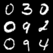

# Auxiliary Classifier Generative Adversarial Networks (ACGANs)

## Sample Image

|||||
|:--:|:--:|:--:|:--:|
|Image||||
|Description|Real Image|Generated Image (Epoch - 199)|Generated Image (Epoch - 199)|

## Metrics

|Data|Metric|Value|
|:--:|:--:|:--:|
|Train|G GANLoss|0.70010|
|Train|G NLLLoss|0.00146|
|Train|G Loss|0.70160|
|Train|D GANLoss|1.39000|
|Train|D NLLLoss|0.02623|
|Train|D Loss|1.41600|
|Train|Accuracy|0.99970|
|Validation|G GANLoss|0.69770|
|Validation|G NLLLoss|2.07e-5|
|Validation|G Loss|0.69780|
|Validation|D GANLoss|1.38200|
|Validation|D NLLLoss|0.02442|
|Validation|D Loss|1.40700|
|Validation|Accuracy|1.00000|
|Test|G GANLoss|0.69580|
|Test|G NLLLoss|1.5e-5|
|Test|G Loss|0.69580|
|Test|D GANLoss|1.38300|
|Test|D NLLLoss|0.02170|
|Test|D Loss|1.40500|
|Test|Accuracy|1.00000|

## train command
```bash
python3 src/train/train_ACGAN.py experiment=mnist_ACGAN.yaml
```

## inference command
```bash
python3 src/inference/inference_ACGAN.py -o=result -d=cuda -ckpt=logs/train/runs/2023-11-09_13-34-11/ckpt/model/epoch_199.pth -l=7
```

- o: output이 저장될 폴더 경로
- d: device (cpu, cuda, mps, ...)
- ckpt: checkpoint 경로
- l: condition으로 줄 label (0~9)

## architecture


## Key Point

- ACGAN은 기존 GAN의 discriminator가 class분류까지 수행하도록 하고, gan loss에 class 분류 loss를 추가하여, 조건부 output을 생성할 수 있게 됨.
- ACGAN은 cGAN에 비해 conditional 정보를 보다 더 적극적으로 활용한다는데 차이점이 있다.
- NLLLoss를 사용하는경우, input은 log-probability이다. (네트워크의 맨 마지막 단에 Log Softmax를 취해야한다.) => 이것은 네트워크의 마지막단에 아무것도 달지 않고, CrossEntropyLoss를 활용하는 것과 동치이다.

### sample image generation 코드

```python
from torchvision.utils import make_grid
import matplotlib.pyplot as plt

labels = [i for i in range(10)] * 10
labels.sort()
labels = torch.tensor(labels)

outputs = ACGAN.Generator(labels)

grid = make_grid(outputs, nrow=10, normalize=True, value_range=(-1, 1))
plt.imshow(grid.permute(1,2,0).data, cmap='binary')
```

