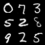
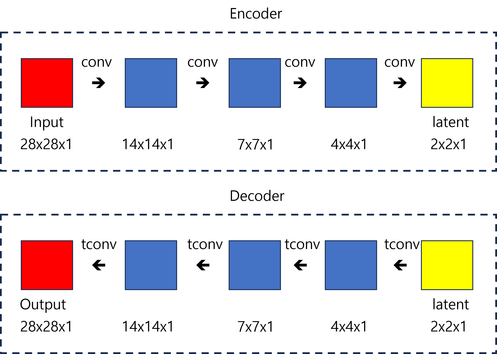

# AutoEncoder (AE)

## Sample Image

||||
|:--:|:--:|:--:|
|Image|||
|Description|Real Image|Generated Image (Epoch - 29)|

## Metrics

|Metric|Value|
|:--:|:--:|
|(Train) MSELoss|0.003459|
|(Validation) MSELoss|0.003530|
|(Test) MSELoss|0.003560|


## train command
```bash
python3 src/train/train_AE.py experiment=mnist_AE.yaml &> logs/train_logs/mnist_AE.log
```

## architecture



*tconv: transposed convolution

## Key Point

- 인코더와 디코더로 이루어진 신경망
  - 인코더: 고차원 입력 데이터를 저차원 representation vector로 압축
  - 디코더: 주어진 representation vector를 원본 차원으로 복원
- 인코더를 학습해서 잠재 공간 안에 랜덤한 잡음까지 나타내기 어렵기 때문에 이미지의 노이즈를 제거하기 위해 쓸수도 있음
