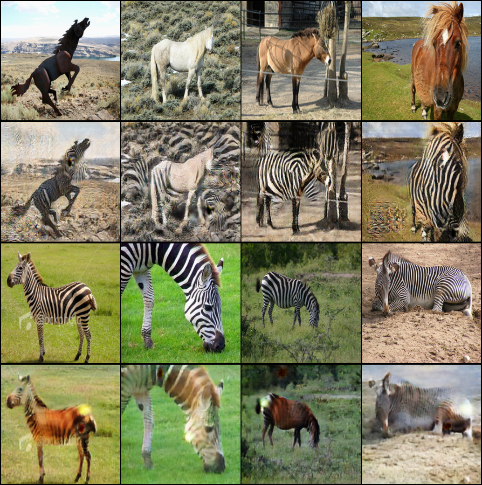
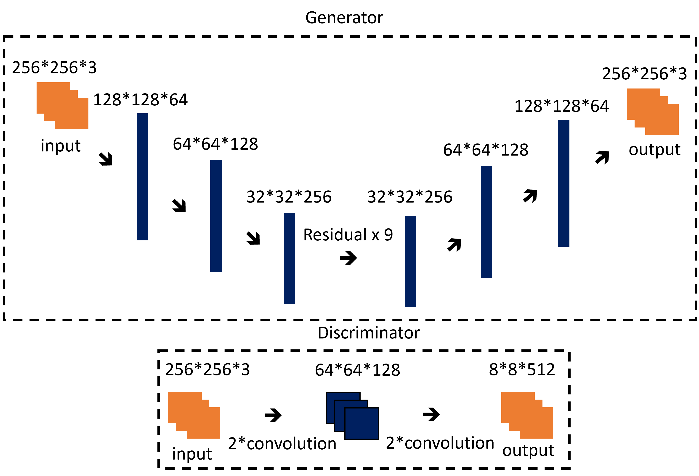

# Cycle Consistent Adversarial Networks (Cycle GAN)

## Sample Image



Generated Image (Epoch - 198)

1st row: real horse
2nd row: fake zebra
3rd row: real zebra
4th row: fake horse

## Metrics

|Data|Metric|Value|
|:--:|:--:|:--:|
|Train|Cycle Loss|0.09659|
|Train|Identity Loss|0.07220|
|Train|GAN Loss|0.88480|
|Train|G Loss|2.21200|
|Train|D_A Loss|0.11110|
|Train|D_B Loss|0.01037|
|Train|D Loss|0.12140|
|Test|Cycle Loss|0.12410|
|Test|Identity Loss|0.09284|
|Test|GAN Loss|1.19700|
|Test|G Loss|2.90200|
|Test|D_A Loss|0.13440|
|Test|D_B Loss|0.35690|
|Test|D Loss|0.49130|

## train command
```bash
python3 src/train/train_CycleGAN.py experiment=horse2zebra_CycleGAN.yaml
```

## inference command
```bash
python3 src/inference/inference_CycleGAN.py -o=result -d=cuda -b=4 -ckpt=logs/train/runs/2023-11-22_16-50-57/ckpt/model/epoch_199.pth
```

- o: output이 저장될 폴더 경로
- d: device (cpu, cuda, mps, ...)
- b: batch size
- ckpt: checkpoint 경로

## architecture



## Key Point

- **소스와 타깃 도메인의 이미지 쌍(pair) 없이도 모델을 훈련 가능**
- 소스와 타깃 도메인을 양방향으로 훈련하며, 반대 방향까지 함께 변환가능.
- g_AB는 A->B로 변환, g_BA는 B->A로 변환, d_A는 A의 진짜 이미지와, g_BA가 만든 이미지를 구별, d_B는 B의 진짜 이미지와 g_AB가 만든 이미지를 구별
- 생성자는 U-Net 또는 **ResNet구조 활용**, 경험상 Unet형태로 skip-connection을 주면, 사실적인 이미지로 퀄리티가 좋아지지만, 이미지가 변화해야하는 얼룩말 무늬 재현은 연결을 끊었을때 더 잘됨. (공간 복원을 위해서는 skip-connection이 좋음, down sampling을 3번만 하는 이유)
- 판별자는 **PatchGAN 모델의 판별자 구조**를 사용하여, 각 중첩된 패치가 진짜인지 가짜인지를 추측. (이미지의 일부영역을 보고 구분하므로, 내용이 아닌 스타일을 사용하여 결정함)
- 스타일 트랜스퍼 문제에서 더 나은 결과를 보이는 **Instance Norm을 활용**
- **Loss**
  - gan loss: 판별자를 속일정도의 사실적인 이미지인지?
  - cycle loss: 두 생성자를 교대로 적용했을때, 원본이미지를 얻는지?
  - identity loss: 원래 자신의 타깃 도메인에 생성자를 적용했을때 이미지가 변화하지 않고 남아있는지?
