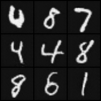

# Deep Convolutional Generative Adversarial Networks (DCGAN)

## Sample Image

||||
|:--:|:--:|:--:|
|Image|||
|Description|Real Image|Generated Image (Epoch - 121)|

## Metrics

|Data|Metric|Value|
|:--:|:--:|:--:|
|Train|G Loss|100|
|Train|D Loss|0|
|Validation|G Loss|0|
|Validation|D Loss|100|
|Test|G Loss|0|
|Test|D Loss|100|

## train command
```bash
python3 src/train/train_GAN.py experiment=mnist_DCGAN.yaml
```

## inference command
```bash
python3 src/inference/inference_DCGAN.py -o=result -d=cuda -ckpt=logs/train/runs/2023-11-08_11-23-25/ckpt/model/epoch_127.pth
```

- o: output이 저장될 폴더 경로
- d: device (cpu, cuda, mps, ...)
- ckpt: checkpoint 경로

## architecture


## Key Point

- 기존 GAN에서 MLP로 이루어진 층을 Convolution Layer로 변경하며 GAN에 비해 높은 품질의 결과를 얻어냄.
- 구현 후 실험해봤을때, bias를 True로 준 경우, Model collapse가 발생함. => 여전히 architecture 변경에 민감함.