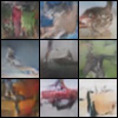

# Deep Convolutional Generative Adversarial Networks (DCGAN)

## train command
```bash
nohup python3 src/train/train_GAN.py experiment=cifar10_DCGAN.yaml &> logs/train_logs/cifar10_DCGAN.log &
```

## architecture


## sample output

