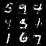

# Generative Adversarial Networks (GANs)

## train command
```bash
nohup python3 src/train/train_GAN.py experiment=mnist_GAN.yaml &> logs/train_logs/mnist_GAN.log &
```

## architecture


## sample output

