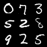

# Generative Adversarial Networks (GANs)

## Sample Image

||||
|:--:|:--:|:--:|
|Image|||
|Description|Real Image|Generated Image (Epoch - 197)|

## Metrics

|Data|Metric|Value|
|:--:|:--:|:--:|
|Train|G Loss|0.8730|
|Train|D Loss|1.7150|
|Validation|G Loss|1.5850|
|Validation|D Loss|0.8949|
|Test|G Loss|1.5760|
|Test|D Loss|0.9098|

## train command
```bash
python3 src/train/train_GAN.py experiment=mnist_GAN.yaml
```

## inference command
```bash
python3 src/inference/inference_GAN.py -o=result -d=cuda -ckpt=logs/train/runs/2023-11-05_21-46-13/ckpt/model/epoch_199.pth
```

- o: output이 저장될 폴더 경로
- d: device (cpu, cuda, mps, ...)
- ckpt: checkpoint 경로

## architecture


## Key Point

- GAN에서 Generator와 Discrimininator는 서로 경쟁하며 학습함.
  - Generator는 VAE의 디코더와 같이 잠재 공간의 벡터를 이미지로 변환함.
  - 전체 모델을 훈련할때, **생성자의 가중치만 업데이트 되도록 판별자의 가중치를 동결하는 것**이 중요함.
  - learning rate를 비롯하여, 많은 **하이퍼파라미터를 매우 주의깊게 튜닝해야함** (파라미터의 변화에 매우 민감하여, 불안정한 학습상태가 발생할 수 있음).
    - 수렴하지 못하고, 진동하는 loss
    - Mode Collapse: 생성자가 판별자를 속이는 적은 수의 샘플을 찾을때, 계속 같은 이미지만 생성함.
    - Generator는 Discriminator에 의해 평가되고, Discriminator는 계속 발전하므로, **단순히 G Loss가 작다고 해서 좋은 모델이 아님** (모니터링 하기 어려움).