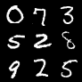
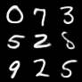
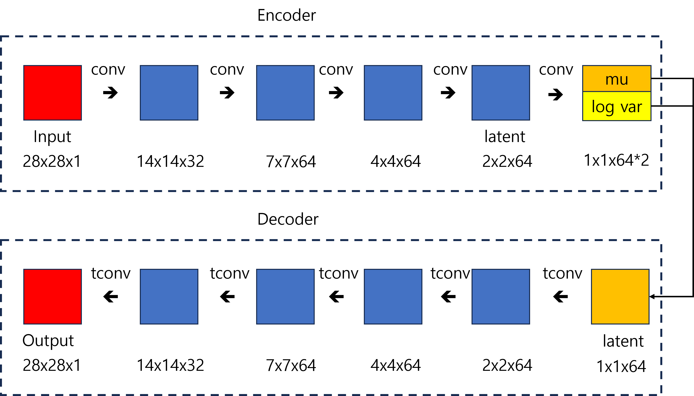
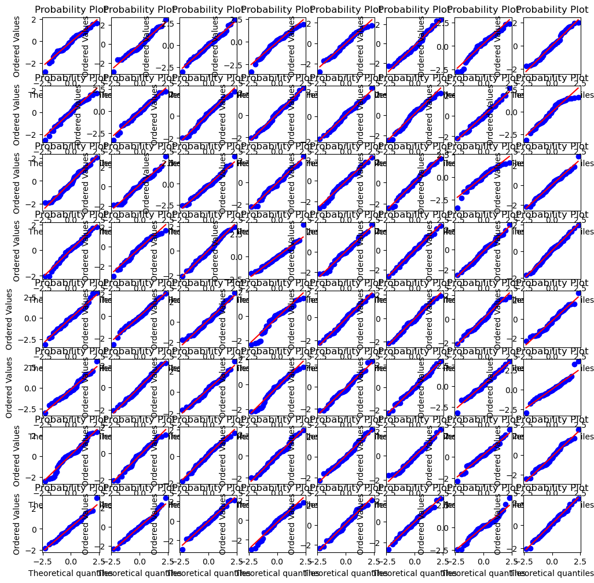

# VariationalAutoEncoder (VAE)

## Sample Image

||||
|:--:|:--:|:--:|
|Image|||
|Description|Real Image|Generated Image (Epoch - 29)|

## Metrics

|Data|Metric|Value|
|:--:|:--:|:--:|
|Train|MSELoss|0.03354|
|Train|KLLoss|0.02870|
|**Train**|**TotalLoss**|**0.06222**|
|Validation|MSELoss|0.03546|
|Validation|KLLoss|0.02825|
|**Validation**|**TotalLoss**|**0.06371**|
|Test|MSELoss|0.03562|
|Test|KLLoss|0.02833|
|**Test**|**TotalLoss**|**0.06395**|


## train command
```bash
python3 src/train/train_VAE.py experiment=mnist_VAE.yaml
```

## inference command
```bash
python3 src/inference/inference_VAE.py -o=result -d=cuda -ckpt=logs/train/runs/2023-11-01_11-35-03/ckpt/model/epoch_29.pth
```

- o: output이 저장될 폴더 경로
- d: device (cpu, cuda, mps, ...)
- ckpt: checkpoint 경로

## architecture



*tconv: transposed convolution

## Key Point

- VAE에서 각 이미지는 잠재공간에 있는 포인트 주변의 다변수 정규분포(multivariate normal distribution)에 매핑됨.
  - 인코더는 입력시미지를 받아 잠재공간의 다변수 정규분포를 정의하는 2개의 벡터 mu와 log var로 인코딩함.
  - 평균이 mu 이고, 표준 편차가 exp(log var / 2)인 정규 분포에서 포인트 z를 샘플링해서 사용함. (**원점 주변의 공간을 대칭적이고 효과적으로 사용함: interpolation이 가능**)
  - 같은 영역에 위치한 포인트를 비슷한 이미지로 디코딩 하게 함으로써, **본적 없는 포인트에서도 제대로된 이미지를 디코딩 할 수 있는 좋은 성질을 갖게 됨.**
- Mode collapse issue가 있을때, 아래 글을 참고하여 KL Loss의 weight를 조정함으로써 정상작동함.
  - https://www.quora.com/How-do-you-fix-a-Variational-Autoencoder-VAE-that-suffers-from-mode-collapse
- 디코더가 input이미지를 제대로 복원하지 못하고 오타가 나는 경우, 잠재공간의 차원을 키워주면 정상작동함. (복잡한 정보를 충분히 인코딩하기 위한 차원이 필요함)
- **잠재공간의 포인트 분포가 다변수 표준 정규 분포와 비슷한지 확인해야함** (차원마다 개별적으로)

### 잠재공간 Q-Q plot 코드 (64 dim)

```python
from scipy.stats import probplot
import matplotlib.pyplot as plt

f, axes = plt.subplots(8, 8, figsize=(12, 12))
for r in range(8):
    for c in range(8):
        probplot(z.squeeze()[:, 8*r+c].numpy(), plot=axes[r][c])
```

