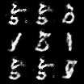

# Wasserstein Generative Adversarial Networks - Gradient Penalty (WGAN-GP)

## Sample Image

||||
|:--:|:--:|:--:|
|Image|||
|Description|Real Image|Generated Image (Epoch - 199)|

## Metrics

|Data|Metric|Value|
|:--:|:--:|:--:|
|Train|G Loss|-0.1707|
|Train|D Loss|-0.5298|
|Train|Gradient Penalty|0.1396|
|Validation|G Loss|-0.1766|
|Validation|D Loss|-0.6816|
|Test|G Loss|-0.1801|
|Test|D Loss|-0.6787|

## train command
```bash
nohup python3 src/train/train_WGAN-GP.py experiment=mnist_WGAN-GP.yaml
```

## inference command
```bash
python3 src/inference/inference_WGAN-GP.py -o=result -d=cuda -ckpt=logs/train/runs/2023-11-21_17-37-47/ckpt/model/epoch_199.pth
```

- o: output이 저장될 폴더 경로
- d: device (cpu, cuda, mps, ...)
- ckpt: checkpoint 경로

## architecture


## Key Point

- **WGAN의 Critic에서 3가지를 변경**해야함
  - Critic의 Loss function에 gradient penalty 항을 추가 (립시츠 제약을 강제하는 또다른 방법)
  - Critic의 가중치를 클리핑 하지 않음
  - Critic에 배치 정규화 층을 제거함 (배치 정규화는 같은 배치 안 이미지들에 상관관계를 만들기 때문에, gp의 효과가 떨어짐)
- 손실함수가 훨씬 안정적으로 수렴함.
- 경험상 mnist data에 비해, DCGAN등 기존 GAN보다 converge하는데 더 오래걸림 (약 50에폭)
- 기존 DCGAN 구조를 활용할 때, d loss가 거의 -8000까지 내려가는 등 loss 함수의 값이 이상함, 그러나 생성된 결과물은 나쁘지 않음 (convolution net의 경우 그렇다는 글이 있어, mlp로도 실험해 보았지만 이는 원인이 아님, 모델 구조를 변경했을때 이러한 현상이 고쳐짐) -> **GP가 더욱 안정적인 학습을 돕는다지만, 모델 아키텍처에 대한 탐색이 필요함.**