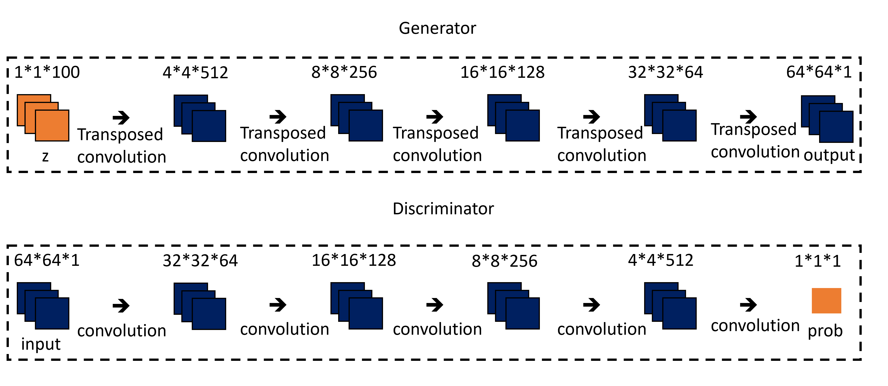

# Wasserstein Generative Adversarial Networks (WGANs)

## Sample Image

||||
|:--:|:--:|:--:|
|Image|||
|Description|Real Image|Generated Image (Epoch - 199)|

## Metrics

|Data|Metric|Value|
|:--:|:--:|:--:|
|Train|G Loss|0.3424|
|Train|D Loss|-0.6741|
|Validation|G Loss|0.5447|
|Validation|D Loss|-0.5118|
|Test|G Loss|0.5450|
|Test|D Loss|-0.5120|

## train command
```bash
python3 src/train/train_WGAN.py experiment=mnist_WGAN.yaml
```

## inference command
```bash
python3 src/inference/inference_DCGAN.py -o=result -d=cuda -ckpt=logs/train/runs/2023-11-10_11-51-35/ckpt/model/epoch_199.pth
```

- o: output이 저장될 폴더 경로
- d: device (cpu, cuda, mps, ...)
- ckpt: checkpoint 경로

## architecture



## Key Point

- 안정적인 GAN 훈련을 위해, Binary Cross Entropy Loss 대신 **Wasserstein loss**를 사용함.
  - **Wasserstein loss**는 y_i를 [1,0] 대신 [1, -1]을 사용, discriminator의 마지막 층에서는 Sigmoid함수를 제거하여, [0, 1] 범위에 국한되지 않고, [-inf, inf]의 범위를 갖도록 함. => discriminator대신 critic이라고 부름.

$$-{1 \over n} \sum^n_{i=1}(y_ip_i)$$

- WGAN은 **더 작은 학습률**을 사용하는 경우가 많음.
- Wasserstein loss는 아주 큰 값일 수 있고, **critic은 1-Lipschitz continuous function이어야 한다**는 추가적인 제약이 필요함.

$${|D(x_1) - D(x_2)| \over |x_1 - x_2|} \le 1$$

- 1-Lipschitz continuous function
  - D(x1) - D(x2): 두 critic 예측의 절대값 차이
  - x1 - x2: 두 이미지 픽셀의 평균적인 절대값 차이

- **Gradient Clipping으로 critic의 weight를 [-0.01, 0.01]안에 놓이도록하여, 립시츠 제약을 걸어줌.**
  - 이 방법이 학습 속도를 크게 떨어트림.
- **Generator를 한번 훈련 할때, Critic을 여러번 훈련함.**