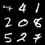
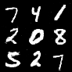
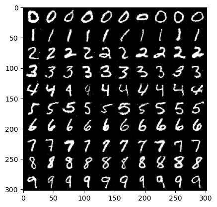
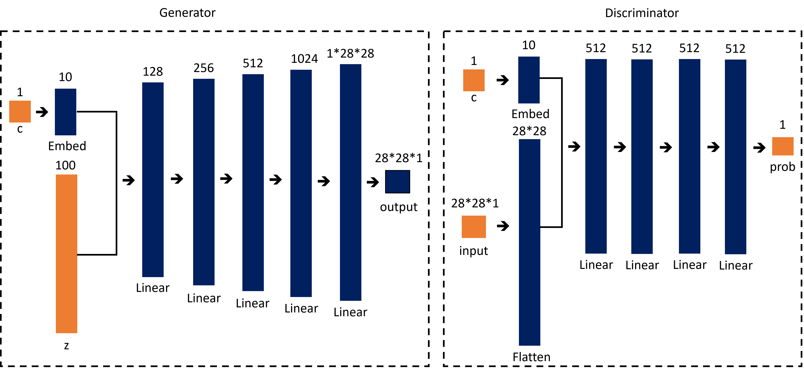

# Conditional Generative Adversarial Networks (cGANs)

## Sample Image

|||||
|:--:|:--:|:--:|:--:|
|Image||||
|Description|Real Image|Generated Image (Epoch - 199)|Generated Image (Epoch - 199)|

## Metrics

|Data|Metric|Value|
|:--:|:--:|:--:|
|Train|G Loss|1.2140|
|Train|D Loss|1.0060|
|Validation|G Loss|0.9799|
|Validation|D Loss|1.3590|
|Test|G Loss|0.9852|
|Test|D Loss|1.3460|

## train command
```bash
python3 src/train/train_cGAN.py experiment=mnist_cGAN.yaml
```

## inference command
```bash
python3 src/inference/inference_cGAN.py -o=result -d=cuda -ckpt=logs/train/runs/2023-11-07_11-08-43/ckpt/model/epoch_199.pth -l=7
```

- o: output이 저장될 폴더 경로
- d: device (cpu, cuda, mps, ...)
- ckpt: checkpoint 경로
- l: condition으로 줄 label (0~9)

## architecture



## Key Point

- cGAN은 기존 GAN에 레이블이라는 추가적인 정보를 줌으로써 class label의 조건부 output을 생성할 수 있게 됨.
- 기존 논문에서는 class label에 대한 one-hot vector를 condition으로 주었지만, 코드 구현에서는 nn.Embedding을 통해 임베딩도 학습하도록 구현함.

### sample image generation 코드

```python
from torchvision.utils import make_grid
import matplotlib.pyplot as plt

labels = [i for i in range(10)] * 10
labels.sort()
labels = torch.tensor(labels)

outputs = cGAN(10*10, labels)

grid = make_grid(outputs, nrow=10, normalize=True, value_range=(-1, 1))
plt.imshow(grid.permute(1,2,0).data, cmap='binary')
```

